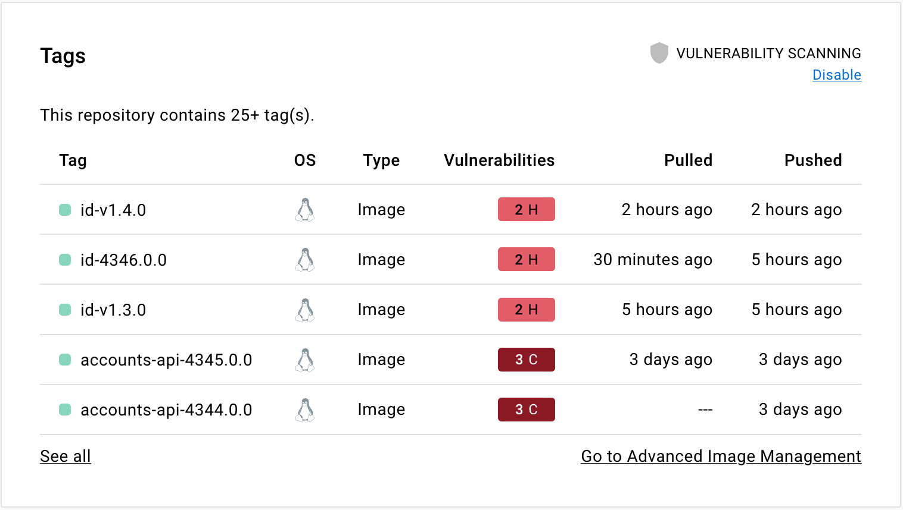
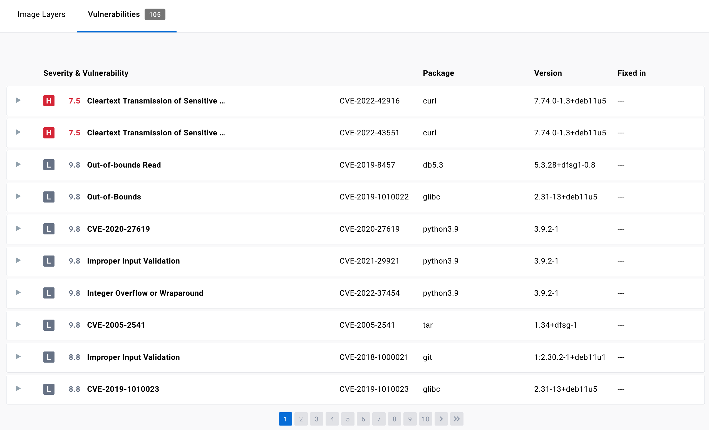

> [!NOTE]
>
> This page describes the legacy static vulnerability scanning feature of
> Docker Hub. There's also [Docker Scout](../scout/index.md), which provides
> more detailed and always up-to-date results, guided remediation steps for
> improving your security posture, and more.
>
> Docker Hub static scanning requires a [Docker Pro, Team, or Business
> subscription](../subscription/index.md).

Docker Hub static vulnerability scanning lets you automatically run a
point-in-time scan on your Docker images for vulnerabilities.

When you push an image to a Docker Hub repository after turning on static
scanning, Docker Hub automatically scans the image to identify vulnerabilities.
The scan results shows the security state of your images at the time when the
scan was run.

Scan results include:

- The source of the vulnerability, such as Operating System (OS) packages and
  libraries
- The version in which it was introduced
- A recommended fixed version, if available, to remediate the vulnerabilities
  discovered.

## Changes to static scanning in Docker Hub

From February 27th, 2023, Docker changed the technology that supports the
Docker Hub static scanning feature. The static scanning is now powered natively
by Docker, instead of a third-party.

As a result of this change, scanning now detects vulnerabilities at a more
granular level than before. This in turn means that vulnerability reports may
show a higher number of vulnerabilities. If you used vulnerability scanning
before February 27th, 2023, you may see that new vulnerability reports list a
higher number of vulnerabilities, due to a more thorough analysis.

There is no action required on your part. Scans continue to run as usual
with no interruption or changes to pricing. Historical data continues to be
available.

## Scan images with static vulnerability scanning

Repository owners and administrators of a Docker Pro, Team, or a Business tier
enable and disable static vulnerability scanning. When scanning is active on a
repository, anyone with push access can trigger a scan by pushing an image to
Docker Hub.

Additionally, repository owners in a Docker Pro subscription and team members in
a Team, or a Business subscription can view the detailed scan reports.

> [!NOTE]
>
> Static vulnerability scanning supports scanning images which are of AMD64
> architecture, Linux OS, and are less than 10 GB in size.

### Turn on static vulnerability scanning

Repository owners and administrators can enable static vulnerability scanning
on a repository. If you are a member of a Team or a Business subscription,
ensure the repository you would like to enable scanning on is part of the Team
or a Business tier.

To enable static vulnerability scanning:

1. Sign in to your [Docker Hub](https://hub.docker.com) account.
2. Select **Repositories** and then choose a repository.
3. Go to the **Settings** tab.
4. Under **Image security insight settings**, select **Static scanning**.
5. Select **Save**.

### Scan an image

To scan an image for vulnerabilities, push the image to Docker Hub, to the
repository for which you have turned on scanning:

1. Ensure you have installed Docker locally. See [Get Docker](../../comecando/obtenha-o-docker.md)
   to download and install Docker on your local machine.
2. Use the command line to log into your Docker account. See
   [`docker login`](../../reference/cli/docker/login.md) for more
   information.
3. Tag the image to scan. For example, to tag a Redis image, run:

   ```console
   $ docker tag redis <your-Docker-ID>/<your-repo-name>:latest
   ```

4. Push the image to Docker Hub to trigger a static vulnerability scan for the
   image:

   ```console
   $ docker push <your-Docker-ID>/<your-repo-name>:latest
   ```

## View the vulnerability report

To view the vulnerability report:

1. Go to [Docker Hub](https://hub.docker.com) and open the repository page to
   view a summary of the static vulnerability scanning report.

   It may take a couple of minutes for the vulnerability report to appear in
   your repository.

   

2. Select the **Tags** tab, then **Digest**, then **Vulnerabilities** to view the
   detailed scan report.

   The scan report displays vulnerabilities identified by the scan, sorting them
   according to their severity, with highest severity listed at the top. It
   displays information about the package that contains the vulnerability, the
   version in which it was introduced, and whether the vulnerability is fixed in
   a later version.

   

For more information on this view, see
[Image details view](../scout/explore/image-details-view.md).

### Inspect vulnerabilities

The vulnerability report sorts vulnerabilities based on their severity. It
displays information about the package that contains the vulnerability, the
version in which it was introduced, and whether the vulnerability has been fixed
in a later version.

The vulnerability scan report also allows development teams and security leads
to compare the vulnerability counts across tags to see whether the
vulnerabilities are decreasing or increasing over time.

### Fix vulnerabilities

Once a list of vulnerabilities have been identified, there are a couple of
actions you can take to remediate the vulnerabilities. For example, you can:

1. Specify an updated base image in the Dockerfile, check your application-level
   dependencies, rebuild the Docker image, and then push the new image to Docker
   Hub.
2. Rebuild the Docker image, run an update command on the OS packages, and push
   a newer version of image to Docker Hub.
3. Edit the Dockerfile to manually remove or update specific libraries that
   contain vulnerabilities, rebuild the image, and push the new image to Docker
   Hub

Docker Scout can provide you with concrete and contextual remediation steps for
improving image security. For more information, see
[Docker Scout](../scout/index.md).

### Turn off static vulnerability scanning

Repository owners and administrators can disable static vulnerability scanning
on a repository. To disable scanning:

1. Sign in to your [Docker Hub](https://hub.docker.com) account.
2. Go to **Repositories** and then select a repository from the list.
3. Go to the **Settings** tab.
4. Under **Image security insight settings**, select **None**.
5. Select **Save**.
